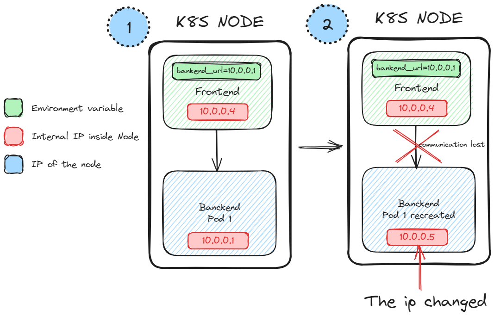
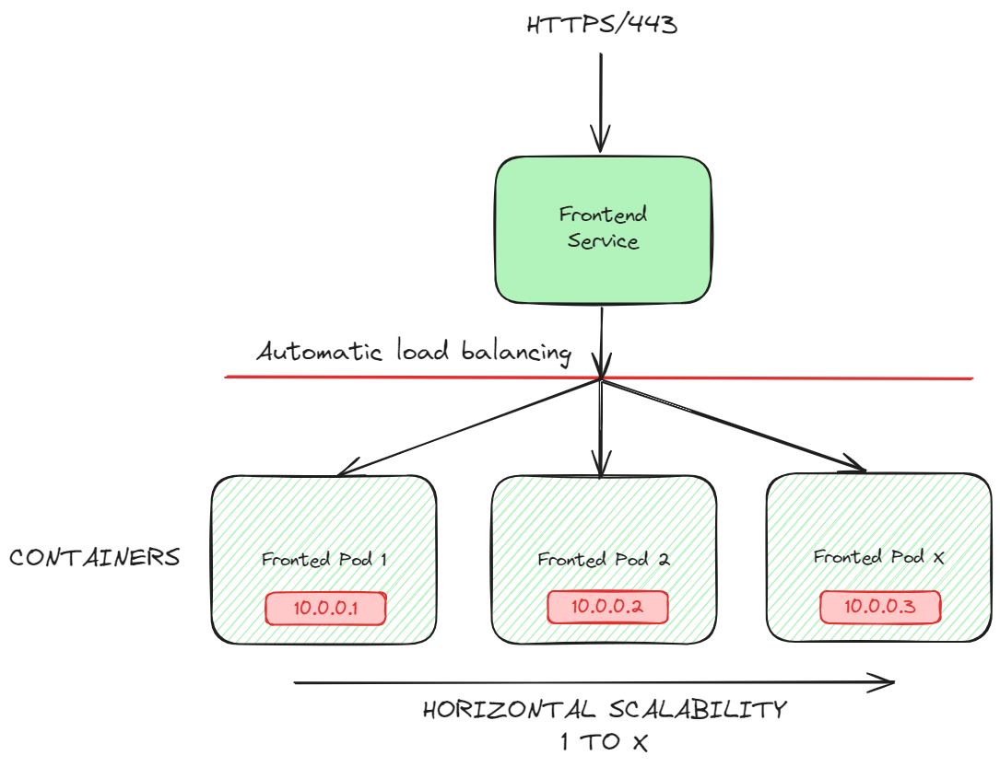

# 3.1 Services & Networking

Each time a Pod is created, the containers will have private IP asignated.

In point `1` of the diagram, we can see two pods, one called frontend and another backend. The front has an environment variable `backend_url` pointing to the IP 10.0.0.1, which allows the frontend pod to communicate with the backend. 

In Figure `2` The backend Pod got recreated, and the IP changed; that is something natural; it's time a pod gets created or recreated the private IP change. This nature causes the communication to be lost.

> [!NOTE]  
> It's vital to remember that the containers are ephemeral, and the IP will change.

## 3.1.1 Load balancing
The [Service](https://kubernetes.io/docs/concepts/services-networking/service/) object provides the hability to scale pods , load balancing among other types of funcionality. But the most important is that with a single IP or DNS we can access to access the service, interanally all the communications will be redirected to the containers like in the next example:

## 3.1.1 Scalability

Kubernetes provides ways to scalate services, Getting the example of the `3.1 Services & Networking` diagram, we need to scalate the backend service from 1 to 3. Now, we have 3 private IP instead of 1, to balance the calls between these 3 containers we need to use a DNS

# REVIEW
- Pods are ephemeral
- IP Change each time a pod is created/recreated
- 