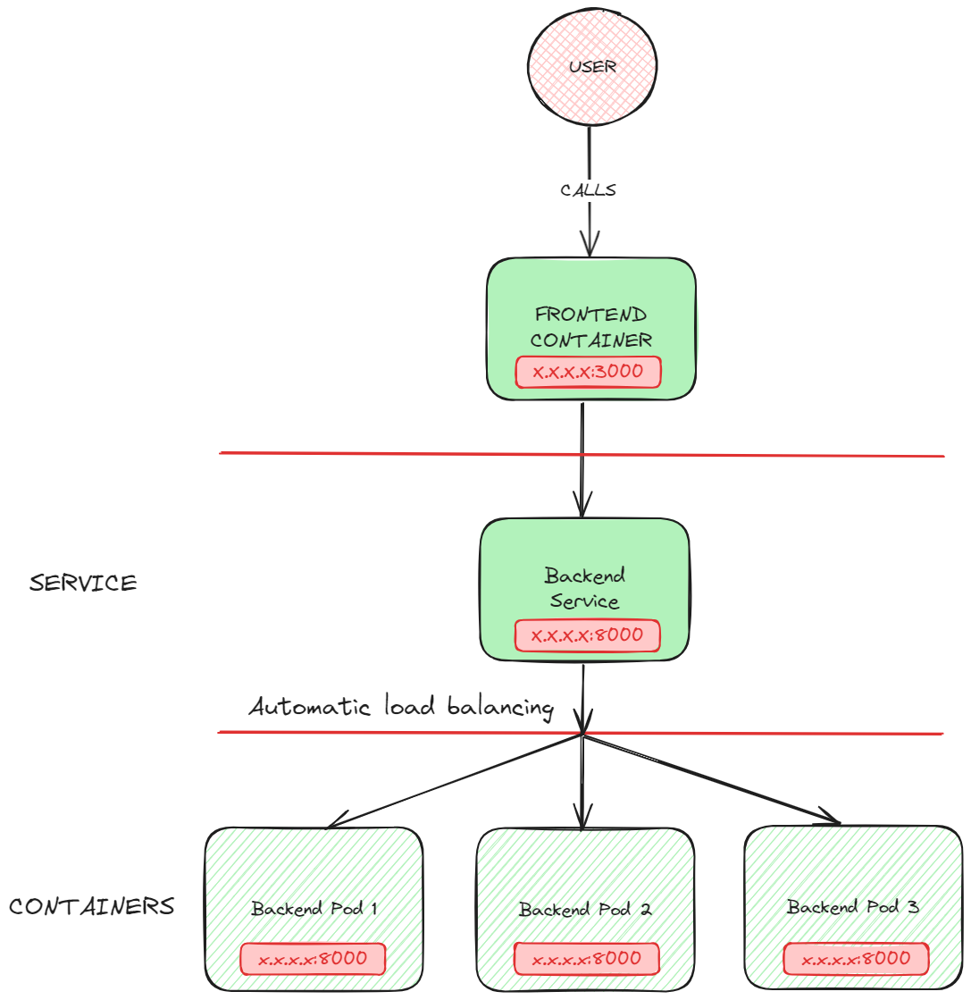

# 3.1 Services & Networking

Each time a Pod is created, the containers will have private IP asignated.

In point `1` of the diagram, we can see two pods, one called frontend and another backend. The front has an environment variable `backend_url` pointing to the IP 10.0.0.1, which allows the frontend pod to communicate with the backend. 


In Figure `2` The backend Pod got recreated, and the IP changed; that is something natural; it's time a pod gets created or recreated the private IP change. This nature causes the communication to be lost.

> [!NOTE]  
> It's vital to remember that the containers are ephemeral, and the IP will change.

## 3.1.1 Load balancing
The [Service](https://kubernetes.io/docs/concepts/services-networking/service/) object provides the hability to scale pods , load balancing among other types of funcionality. But the most important is that with a single IP or DNS we can access to access the service, interanally all the communications will be redirected to the containers like in the next example:


## 3.1.1 Scalability

Kubernetes provides ways to scalate services, Getting the example of the `3.1 Services & Networking` diagram, we need to scalate the backend service from 1 to 3. Now, we have 3 private IP instead of 1, to balance the calls between these 3 containers we need to use a DNS

# REVIEW
- Pods are ephemeral
- IP Change each time a pod is created/recreated
- 


# Practices
For all these practices you must have the command line terminal located at the folder `cka-certification/certification/3-servicing-and-networking/`

## Backend losing connection

In this exercise, we are going to practice how IP works in containers and how easy it is to lose a connection if the connections are not well understood. The main idea is that using the private IP directly is not a good idea on Kubernetes because pods are temporal, a container can die or get rebooted and change the IP.

1. Create the backend pod:
```bash
kubectl apply -f practices/kubernetes/1-practice/backend-pod.yaml 
```
2. Get the backend IP:
```bash
kubectl get pod practice-3-1-backend -o jsonpath='{.status.podIP}'
```
3. Test the backend connection:
```bash
# GET FRONT IP
kubectl get pods -o wide
# CURL backend
kubectl exec -it curl -- curl http://<IP>:8000
```
It should shows `{"Hello":"World"}`
4. Restart POD: 
```bash
kubectl delete pod practice-3-1-backend
kubectl apply -f practices/kubernetes/1-practice/backend-pod.yaml 
```
5. Test the backend connection again:
```bash
# GET FRONT IP
kubectl get pods -o wide
# CURL backend
kubectl exec -it curl -- curl http://<IP>:8000
```
It should fail because the IP changed. To avoid this problem, go to the next practice. 

## Service and Endpoint

As you can see in the diagram, the objective is to call from the navigator to the frontend URL and be able to retrieve information from the backend service. Once we call the frontend service, in an optimal situation, the service will respond with `Hello, This is the Frontend Practice of the CKA exam! The backend call result is {"Hello":"World"}` where `{"Hello":"World"}` is coming from the backend service. To do so, we need to run the next commands:

1. Apply backend service:
```bash
kubectl apply -f practices/kubernetes/2-practice/backend-service.yaml 
```
2. Apply backend Deployment:
```bash
kubectl apply -f practices/kubernetes/2-practice/backend-deployment.yaml 
```
3. Check pods: 
```bash
kubectl get pods
```
4. Test backend connection:
```bash
kubectl apply -f practices/kubernetes/2-practice/curl-pod.yaml
# TEST connection
kubectl exec -it curl -- nslookup practice-3-2-backend-service.default.svc.cluster.local
# CURL backend
kubectl exec -it curl -- curl http://practice-3-2-backend-service.default.svc.cluster.local:8000/
```
if it respond with `{"Hello":"World"}` the backend is well configured.
5. Apply the frontend pod:
```bash
kubectl apply -f practices/kubernetes/2-practice/frontend-pod.yaml 
```
6. Test the frontend connection:
```bash
# GET FRONT IP
kubectl get pods -o wide
# CURL frontend
kubectl exec -it curl -- curl http://<IP>:3000/
```
6. Clean up the example: 
```bash
kubectl delete -f practices/kubernetes/2-practice/curl-pod.yaml
kubectl delete -f practices/kubernetes/2-practice/backend-service.yaml 
kubectl delete -f practices/kubernetes/2-practice/backend-deployment.yaml 
kubectl delete -f practices/kubernetes/2-practice/frontend-pod.yaml 
```
